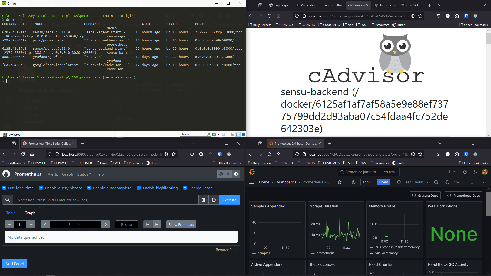

# Résultat à obtenir

<figure><figcaption></figcaption></figure>

## Bridge

### Inspecter le réseau

```bash
docker network inspect bridge
```

```bash
[
    {
        "Name": "bridge",
        "Id": "9ab130fff4efc54c78ade0d7afd346fdfb6aca3bc0f69f5bc80f9a625fbb039a",
        "Created": "2024-09-23T06:46:41.720903947Z",
        "Scope": "local",
        "Driver": "bridge",
        "EnableIPv6": false,
        "IPAM": {
            "Driver": "default",
            "Options": null,
            "Config": [
                {
                    "Subnet": "172.17.0.0/16",
                    "Gateway": "172.17.0.1"
                }
            ]
        },
        "Internal": false,
        "Attachable": false,
        "Ingress": false,
        "ConfigFrom": {
            "Network": ""
        },
        "ConfigOnly": false,
        "Containers": {
            "a29a328864fa9f910c12e852a2111fff01a572f5cc209dddfade818056ac2dda": {
                "Name": "prometheus",
                "EndpointID": "e97cbd4a303fa6c621330c8ff11aae1d54e6d929bfa495700468d3a6a41ef8a7",
                "MacAddress": "02:42:ac:11:00:04",
                "IPv4Address": "172.17.0.4/16",
                "IPv6Address": ""
            },
            "aaa253806865db1889f38f6869ee178ad646e9ebfa2ff52061eb0c57a8698204": {
                "Name": "grafana",
                "EndpointID": "3330d8cb02f9438cb44bc720378772ff988f15d4b881c85d2b8cdfcd3d32093c",
                "MacAddress": "02:42:ac:11:00:02",
                "IPv4Address": "172.17.0.2/16",
                "IPv6Address": ""
            },
            "f6a7c8438c0594d85d871c608d7b4967f1a5139d834d275d052499a46c87be7f": {
                "Name": "cadvisor",
                "EndpointID": "cbfaeaf82e5d778dee69d1dd8f32e7accbd168aac874ebd66f1f9f99688d2242",
                "MacAddress": "02:42:ac:11:00:03",
                "IPv4Address": "172.17.0.3/16",
                "IPv6Address": ""
            }
        },
        "Options": {
            "com.docker.network.bridge.default_bridge": "true",
            "com.docker.network.bridge.enable_icc": "true",
            "com.docker.network.bridge.enable_ip_masquerade": "true",
            "com.docker.network.bridge.host_binding_ipv4": "0.0.0.0",
            "com.docker.network.bridge.name": "docker0",
            "com.docker.network.driver.mtu": "1500"
        },
        "Labels": {}
    }
]
```

### Obtenir les noms et adresses ip

```bash
docker network inspect bridge | jq -r ".[0].Containers[] | \"\(.Name) \(.IPv4Address)""
```

```bash
prometheus 172.17.0.4/16
grafana 172.17.0.2/16
cadvisor 172.17.0.3/16
```

