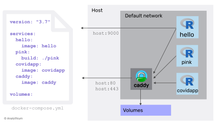

# Docker Compose

<figure><figcaption><p>Source : <a href="https://dionarodrigues.dev/blog/docker-compose-orchestrating-and-automating-services">dionarodrigues.dev</a></p></figcaption></figure>

## Introduction

* [Source officielle](https://docs.docker.com/compose/)

Docker Compose est un outil permettant de définir et d'exécuter <mark style="color:orange;">des applications multi-conteneur</mark>s. C'est la clé d'une expérience de développement et de déploiement rationalisée et efficace.

Compose simplifie le contrôle de l'ensemble de votre pile d'applications, <mark style="color:orange;">en facilitant la gestion des services, des réseaux et des volumes dans un seul fichier de configuration YAML</mark>  compréhensible.

Ensuite, avec une seule commande, vous créez et démarrez tous les services à partir de votre fichier de configuration.

Compose <mark style="color:orange;">fonctionne dans tous les environnements</mark> : production, staging, development, testing, ainsi que dans les flux de travail CI (intégration continue). <mark style="color:orange;">Il dispose également de commandes permettant de gérer l'ensemble du cycle de vie de votre application.</mark>


Source : [Miro Medium](https://dearsikandarkhan.medium.com/microservices-architecture-for-e-commerce-f8b49270e72f)


## Concepts clés de "Docker compose"

* [Source officielle](https://docs.docker.com/compose/intro/features-uses/)

L'utilisation de Docker Compose offre plusieurs avantages qui rationalisent le développement, le déploiement et la gestion des applications conteneurisées :

### Contrôle simplifié

Docker Compose vous permet de définir et de gérer des applications multi-conteneurs dans un seul fichier YAML. Cela simplifie la tâche complexe d'orchestration et de coordination des différents services, ce qui facilite la gestion et la réplication de votre environnement applicatif.

### Collaboration efficace

Les fichiers de configuration de Docker Compose sont faciles à partager, ce qui facilite la collaboration entre les développeurs, les équipes d'exploitation et les autres parties prenantes. Cette approche collaborative permet de fluidifier les flux de travail, d'accélérer la résolution des problèmes et d'améliorer l'efficacité globale.

### Développement rapide d'applications

Compose met en cache la configuration utilisée pour créer un conteneur. Lorsque vous redémarrez un service qui n'a pas changé, Compose réutilise les conteneurs existants. La réutilisation des conteneurs permet d'apporter très rapidement des modifications à l'environnement.

### Portabilité d'un environnement à l'autre

Compose prend en charge les variables dans le fichier Compose. Vous pouvez utiliser ces variables pour personnaliser votre composition pour différents environnements ou différents utilisateurs.

### Une communauté et un support étendus

Docker Compose bénéficie d'une communauté dynamique et active, ce qui se traduit par une abondance de ressources, de tutoriels et de support. Cet écosystème axé sur la communauté contribue à l'amélioration continue de Docker Compose et aide les utilisateurs à résoudre les problèmes de manière efficace.


## Exemple de code

```docker
version: "3.7"

services:
  hello:
    image: registry.gitlab.com/analythium/shinyproxy-hello/hello:latest
    restart: unless-stopped
    ports:
      - "9000:3838"
  pink:
    build: ./pink
    restart: unless-stopped
    expose:
      - "3838"
  covidapp:
    image: analythium/covidapp-shiny:minimal
    restart: unless-stopped
    expose:
      - "3838"
  caddy:
    image: caddy:2.3.0-alpine
    restart: unless-stopped
    ports:
      - "80:80"
      - "443:443"
    volumes:
      - $PWD/Caddyfile:/etc/caddy/Caddyfile
      - $PWD/site:/srv
      - caddy_data:/data
      - caddy_config:/config
    depends_on:
      - hello
      - pink
      - covidapp

volumes:
  caddy_data:
  caddy_config:
```

<figure><figcaption><p>Source : <a href="https://www.r-bloggers.com/2021/06/shiny-apps-with-docker-compose-part-1-development/">r-bloggers.com</a></p></figcaption></figure>
